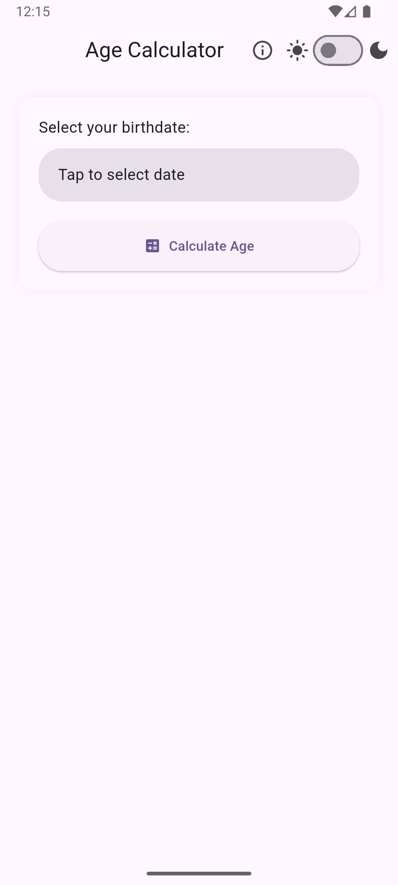
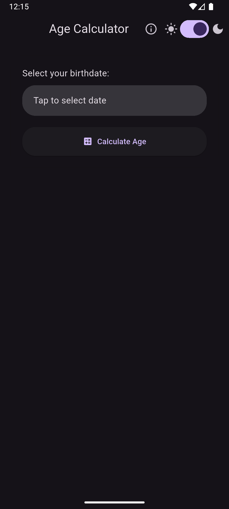

<h1 align="center">🎂 AGE CALCULATOR</h1>

  

<em>Age Calculator is a simple, elegant, and accurate mobile application built using Flutter that allows users to calculate their age in years, months, and days based on their birthdate. The app also provides a countdown to the next birthday and supports light and dark mode themes for better user experience.

With a sleek and minimal UI, birthday-themed visuals, and responsive performance, the app is a handy tool for everyday age calculations. Whether you're checking a friend's birthday or tracking your own milestones, this app delivers instant results in a clean and intuitive interface.</em>

---

### 🛠 Built With:

  
  
  
  
  
  
  
  
  

---

## 📱 App Preview

| Light Mode | Dark Mode |
|------------|-----------|
|  |  |

---

## 📦 Features

- 🎯 Select your birthdate using a smooth **Cupertino date picker**
- 📆 Displays age in **Years, Months, Days**
- 🎉 Shows **countdown** to your next birthday
- 🌙 Switch between **Light/Dark Mode**
- ✨ Modern UI with rounded cards and animations
- 🧁 Birthday-themed **app icon & splash screen**

---

## 📦 APK

[Download Latest APK](https://github.com/bhanuu05/Age-Calculator/releases)

---

## 💡 Author

Made with ❤️ by **Bhanu Pratap Singh**

